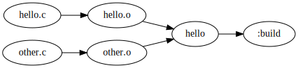

Knitfile:

```lua
local knit = require("knit")

local conf = {
    cc = cli.cc or "gcc",
    debug = tobool(cli.debug) or false,
}

local cflags := -Wall

if conf.debug then
    cflags := $cflags -Og -g
else
    cflags := $cflags -O2
end

local src = knit.glob("*.c")
local obj = knit.extrepl(src, ".c", ".o")
local prog := hello

return b{
    $ $prog: $obj
        $(conf.cc) $cflags $input -o $output
    $ %.o: %.c
        $(conf.cc) $cflags -c $input -o $output
    $ clean:VBQ:
        knit :all -t clean
}
```

Targets:

* `knit hello`: builds hello.
* `knit clean`: cleans build files.

Configuration parameters:

* `knit [target] cc=gcc`: sets the C compiler to gcc.
* `knit [target] debug=1`: enables debug flags (`-Og -g`).

Graph:


