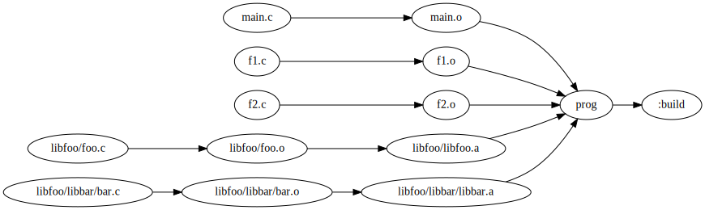

Run `knit` to build a project using `libfoo/libfoo.a` and
`libfoo/libbar/libbar.a` as dependencies that are built using sub-builds.

Run `knit clean` to remove generated files.

You can also run `knit libfoo.a` from `libfoo/` and `knit libbar.a` from
`libfoo/libbar` (or `knit libbar/libbar.a` from `libfoo`).

Run `knit clean -r` to run the `clean` target from the root, even if you are
located in a sub-directory.

