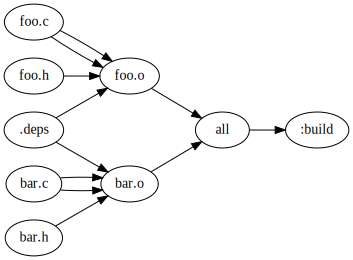

Example showing a C project with dependency files put in a `.deps` folder.

```lua
local depsdir = ".deps"

return b{
    $ all:V: foo.o bar.o
    $ $depsdir:
        mkdir -p $depsdir
    $ %.o:D[$depsdir/%.d]: %.c $depsdir[I]
        gcc -MMD -MF $depsdir/$match.d -c $input -o $output
    $ clean:VB:
        rm -f *.o *.d
}
```

Graph:


