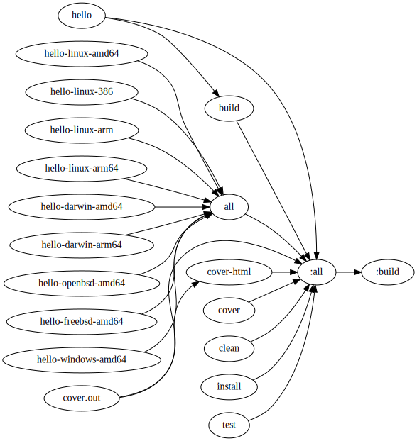

Knitfile:

```lua
local flags := -trimpath -ldflags "-s -w"
local name := hello

local systems = {
    f"$name-linux-amd64",
    f"$name-linux-386",
    f"$name-linux-arm",
    f"$name-linux-arm64",
    f"$name-darwin-amd64",
    f"$name-darwin-arm64",
    f"$name-openbsd-amd64",
    f"$name-freebsd-amd64",
    f"$name-windows-amd64",
}

return b{
    $ build:VB: $name

    $ $name:B:
        go build $flags

    $ install:VB:
        go install $flags

    $ all:V: $systems

    $ ($name-(.*)-(.*)):R:
        GOOS=$match2 GOARCH=$match3 go build $flags -o $match1

    $ test:VB:
        go test

    $ cover.out:B:
        go test -coverprofile cover.out

    $ cover-html:VB: cover.out
        go tool cover -html=$input

    $ cover:VB:
        go test -cover

    $ clean:VBQ:
        knit :all -t clean
}
```

Targets:

* `knit build`: build.
* `knit install`: install to gopath.
* `knit test`: test.
* `knit cover`: show test coverage.
* `knit cover-html`: open coverage visualizer in browser.
* `knit all`: build all cross-compilation targets.

Graph:


